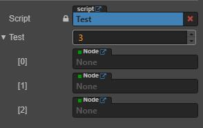
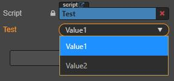

# CCClass 中属性 `property` 属性参数
* `type` 限定属性的数据类型
  ```Typescript
    @property({ type: cc.Node })
    test: cc.Node = null;
    //or
    @property(cc.Node)
    test: cc.Node = null;
    //数组
    @property({ type: cc.Node })
    private test: cc.Node[] = [];
    //or
    @property([cc.Node])
    private test: cc.Node[] = [];
    //如果将 type 设置为枚举，则在属性编辑器中会显示一个下拉框
    //枚举的值不支持字符串
    enum TestEnum {
      Value1 = 0,
      Value2 = 1
    }
    ...
    @property({ type: cc.Enum(TestEnum) })
    private test: TestEnum = TestEnum.Value1;
  ```  
    
    
    
* `visible` 在 **属性性检查器** 中显示或隐藏
  ```Typescript
    isShow: boolean = false;
    @property({ type: cc.Node, visible() { return this.isShow; } })
    test: cc.Node = null;
  ```  
    
* `displayName` 在 **属性检查器** 中显示为另一个名字
  ```Typescript
    @property({ type: cc.Node, displayName: "节点" })
    test: cc.Node = null;
  ```  
    
* `tooltip` 在 **属性检查器** 中添加属性的 Tooltip，将鼠标悬浮于属性上会出现对应的字符串
  ```Typescript
    @property({ type: cc.Node, tooltip: "这是一个节点" })
    test: cc.Node = null;
  ```  
    
* `multiline` 在 **属性检查器** 中使用多行文本框
  ```Typescript    
    @property({ multiline: true })
    private string: string = "";
  ```  
    
* `readonly` 在 **属性检查器** 中只读
  ```Typescript
    @property({ readonly: true })
    private string: string = "over";
  ```  
    
* `min` 限定数值在编辑器中输入的最小值
  ```Typescript
    @property({ min: 0 })
    private index: number = 0;
  ```  
    
* `max` 限定数值在编辑器中输入的最大值
  ```Typescript
    @property({ max: 1 })
    private index: number = 0;
  ```  
    
* `step` 指定数值在编辑器中调节的步长
  ```Typescript
    @property({ step: 1 })
    private index: number = 0;
  ```  
    
* `range`	一次性设置 `min`, `max`, `step`
  ```Typescript
    @property({ range: [0, 1, 1] })
    private index: number = 0;
  ```  
* `slide` 在 **属性检查器** 中显示为滑动条，需要设置 `max` 及 `min`， `step` 无效
  ```Typescript
    @property({ slide: true, min: 0, max: 10, step: 1 })
    private index: number = 0;
  ```  
    
* `serializable` 序列化该属性，指定了 `default` 默认值的属性默认情况下都会被序列化，序列化后就会将编辑器中设置好的值保存到场景等资源文件中，并且在加载场景时自动还原之前设置好的值
  ```Typescript
    @property({ serializable: true })
    private index: number = 0;
  ```  
* `formerlySerializedAs` 指定之前序列化所用的字段名，重命名属性时，声明这个参数来兼容之前序列化的数据
* `editorOnly` 在导出项目前剔除该属性
* `default` 定义属性的默认值
  ```Typescript
    //ts
    @property({type: cc.Node})
    private test: cc.Node = null;
    //js
    test: {
      default: null,
      type: cc.Node
    }
  ```  
* `notify` 当属性被赋值时触发指定方法，用法同 `visible` 需要定义 `default` 属性并且不能用于数组，也不支持 `ES6` 定义方式  
* `override` 当重写父类属性时需要定义该参数为 true
* `animatable` 该属性是否能被 **动画编辑器** 修改，设置为 `true` 后该属性可以在动画编辑器中添加动画
* 定义 `get/set` 方法，设置 `get` 后，属性无法被序列化，也无法设置默认值
  ```Typescript
    //ts
    private _color: cc.Color = cc.Color.WHITE;
    @property({ type: cc.Color })
    get color() {
        return this._color;
    }
    set color(color: cc.Color) {
        this._color = color;
    }
    //js
    color: {
        default: cc.Color.WHITE,
        type: cc.Color
        get: function () {
          return this._color;
        },
        set: function (value) {
          this._color = value;
        }
    },
  ```
